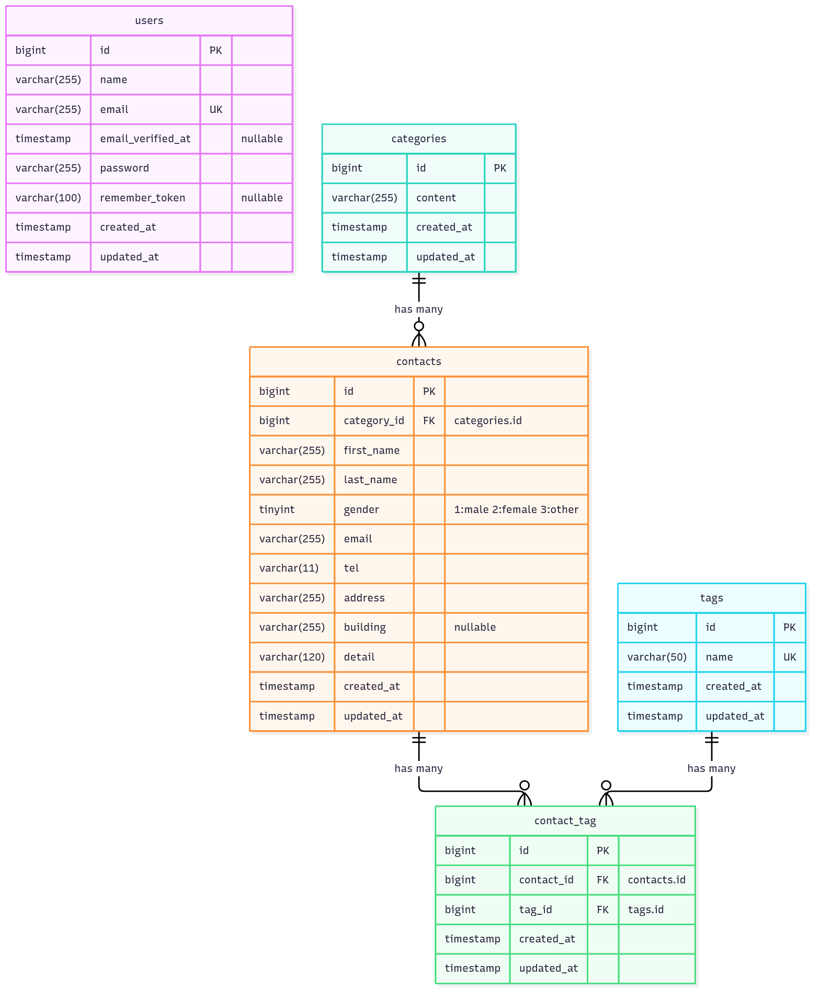
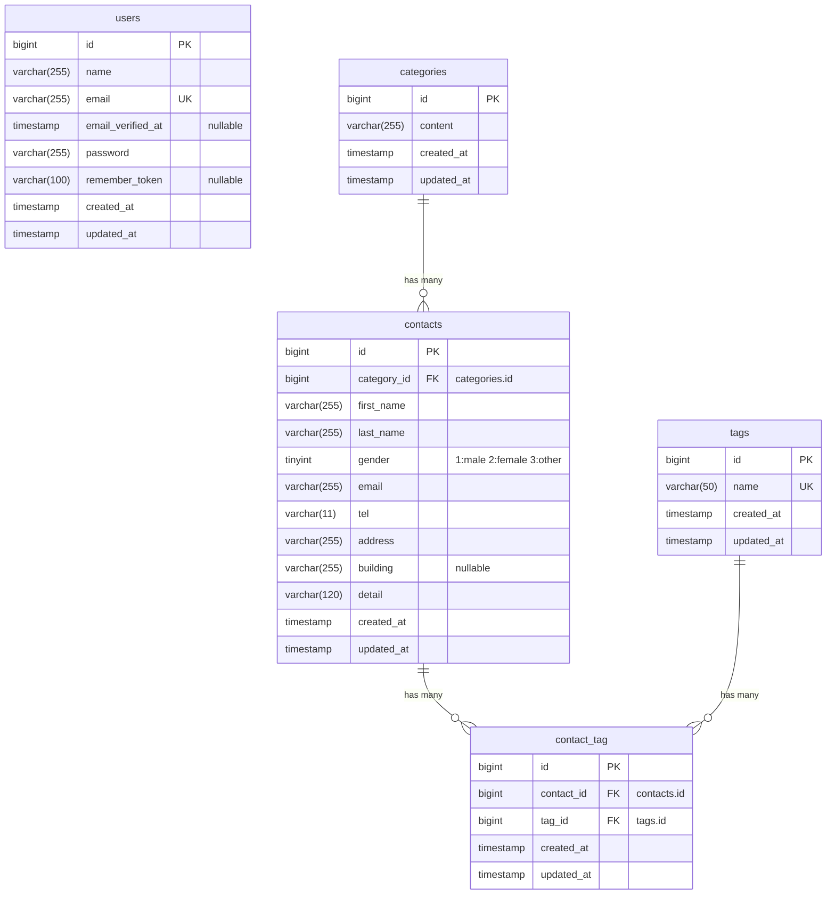

# COACHTECH お問い合わせフォーム（FashionablyLate）

## 概要

COACHTECH 確認テスト「お問い合わせフォーム」のアプリケーションです。
一般のユーザーは誰でもお問い合わせを送信でき、管理者はログイン後にお問い合わせの確認・検索・削除、タグの管理、CSV 出力ができます。
あわせて、お問い合わせデータを操作できる公開 API（認証なし）を備えています。

### 実装した機能

- お問い合わせフォーム（入力 → 確認 → 送信 → サンクス）と、入力内容のバリデーション（エラーメッセージは日本語）
- 管理者登録・ログイン・ログアウト（Laravel Fortify）
- 管理画面：お問い合わせ一覧（7件ごとのページネーション）、名前・メールアドレス・性別・お問い合わせの種類・日付による検索、詳細表示、削除
- タグ管理：追加・編集・削除
- CSV エクスポート：検索条件に一致するお問い合わせを BOM 付き CSV でダウンロード（条件がなければ全件を新しい順）
- 公開 API：お問い合わせの一覧・詳細・作成・更新・削除
- テスト（PHPUnit）：単体テスト・機能テスト

## 使用技術

- PHP 8.2
- Laravel 10.x
- MySQL 8.0
- Laravel Sail（Docker / Docker Compose）
- Laravel Fortify（認証）
- Blade / Vite / Tailwind CSS 3.4 / Alpine.js
- phpMyAdmin
- Laravel Pint / PHPUnit

## 環境構築

Docker（Docker Desktop など）と Git を使える環境で、以下を順に実行してください。Windows の場合は WSL2 上で実行してください。

1. リポジトリを取得する

    ```bash
    git clone https://github.com/s5-s5/contact-form-app.git
    cd contact-form-app
    ```

2. 環境変数ファイルを作成する

    ```bash
    cp .env.example .env
    ```

3. PHP の依存パッケージ（Laravel Sail を含む）をインストールする

    ```bash
    docker run --rm \
        -u "$(id -u):$(id -g)" \
        -v "$(pwd):/var/www/html" \
        -w /var/www/html \
        -e COMPOSER_CACHE_DIR=/tmp/composer_cache \
        laravelsail/php82-composer:latest \
        composer install
    ```

4. コンテナを起動する（初回はイメージの作成に数分かかります）

    ```bash
    ./vendor/bin/sail up -d
    ```

    `sail` だけでコマンドを実行したい場合は、エイリアスを設定してください（bash の場合は `~/.bashrc`）。

    ```bash
    echo "alias sail='[ -f sail ] && bash sail || bash vendor/bin/sail'" >> ~/.zshrc
    exec $SHELL
    ```

5. アプリケーションキーを生成する

    ```bash
    ./vendor/bin/sail artisan key:generate
    ```

6. テーブルを作成し、初期データを投入する

    ```bash
    ./vendor/bin/sail artisan migrate --seed
    ```

7. フロントエンドの依存パッケージをインストールし、Vite を起動する（起動したままにしてください）

    ```bash
    ./vendor/bin/sail npm install
    ./vendor/bin/sail npm run dev
    ```

    Vite を起動したままにしない場合は、代わりに `./vendor/bin/sail npm run build` でビルドしてください。

## 開発環境 URL

| 画面 | URL |
|---|---|
| お問い合わせフォーム | http://localhost/ |
| 管理者登録 | http://localhost/register |
| ログイン | http://localhost/login |
| 管理画面 | http://localhost/admin |
| phpMyAdmin | http://localhost:8080/ |

初期データで、次の管理者が登録されます。

- メールアドレス：`test@example.com`
- パスワード：`password`

## API エンドポイント一覧

認証は不要です。

| メソッド | パス | 概要 |
|---|---|---|
| GET | `/api/v1/contacts` | お問い合わせ一覧。`keyword`（姓・名・メールの部分一致）・`gender`（1〜3）・`category_id`・`date`（YYYY-MM-DD）で検索、`page`・`per_page`（既定 20、最大 100）でページを指定 |
| GET | `/api/v1/contacts/{contact}` | お問い合わせ詳細（カテゴリ・タグを含む） |
| POST | `/api/v1/contacts` | お問い合わせ作成（`tag_ids` でタグを紐付け） |
| PUT | `/api/v1/contacts/{contact}` | お問い合わせ更新（タグは送信した `tag_ids` に置き換え） |
| DELETE | `/api/v1/contacts/{contact}` | お問い合わせ削除 |

- バリデーションエラーは `422`、存在しない ID は `404`（`{"error": "お問い合わせが見つかりませんでした。"}`）を返します
- エラーメッセージは日本語です

## ER 図

`contacts` と `tags` は、中間テーブル `contact_tag` を介した多対多の関係です（`contact_id` と `tag_id` の組み合わせはユニーク）。
外部キーはいずれも `ON DELETE CASCADE` です。



<details>
<summary>Mermaid 記法（テキスト）</summary>



</details>

## テスト

```bash
# すべてのテストを実行
./vendor/bin/sail artisan test

# カバレッジ付きで実行（.env の SAIL_XDEBUG_MODE に coverage を含めています）
./vendor/bin/sail artisan test --coverage

# コードの整形チェック
./vendor/bin/sail bin pint --test
```

## 実装上の補足

- 最新の Laravel Sail は PHP 8.5・MySQL 8.4 の設定を作るため、指定の技術スタックに合わせて `compose.yaml` を PHP 8.2（`runtimes/8.2`）・MySQL 8.0（公式イメージ `mysql:8.0`）に変更しています
- 技術スタックの Web サーバー（Nginx）について：指定の環境構築手順（Laravel Sail）では Nginx を使わず、Sail 標準の PHP の Web サーバー（`php artisan serve`）でアプリを動かしています
- 確認ページの「修正」は、ブラウザの「戻る」で入力ページに戻ります。ブラウザが入力内容を復元しない場合に備えて、確認ページを表示するときに入力内容を次の1回の表示まで保存しています（送信後の入力ページは初期状態です）
- お問い合わせフォームの電話番号は、3つの入力欄の値を画面側の JavaScript でハイフンなしの1つの値（`tel`）にまとめて送信します。JavaScript が動かない場合に備えて、`StoreContactRequest` でもまとめています
- Vite の入力に、お問い合わせフォーム用の `resources/js/contact/init.js` を追加しています
- 公開 API は認証を行わないため、使用しない Laravel Sanctum は削除しています

## 作成者

shogo
